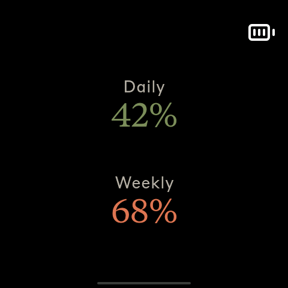
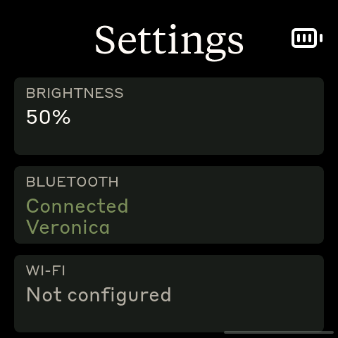

# Clawdmeter

A small ESP32 dashboard I made for my desk to keep an eye on Claude Code usage.

It runs on a [Waveshare ESP32-S3-Touch-AMOLED-2.16](https://www.waveshare.com/esp32-s3-touch-amoled-2.16.htm?&aff_id=149786) as well as a few other alternative boards and pairs over Bluetooth. The UI is three
horizontally swipeable tiles — Home, Claude, and Settings — built on LVGL's
tileview. The two side buttons send Space and Shift+Tab over BLE HID for
Claude Code's voice mode and mode-toggle shortcuts.

## Screens

The device boots on the Home tile. Swipe left/right to move between Home,
Claude, and Settings.

|            Claude             |               Settings               |
| :----------------------------: | :-----------------------------------: |
|  |  |
| Daily / weekly utilization      | Live brightness, Bluetooth, WiFi status |

Home shows a full-screen background image (bake your own in via
`tools/img_to_lvgl.py` — see the Backgrounds section in `CLAUDE.md`). **Hold
the power button for 3 seconds, then release, to put the device into
pairing mode** — this clears the saved Bluetooth bond and re-advertises. A
quick press of the power button cycles screen brightness on any tile.

## Hardware

Boards supported out of the box:

- [Waveshare ESP32-S3-Touch-AMOLED-2.16](https://www.waveshare.com/esp32-s3-touch-amoled-2.16.htm?&aff_id=149786)
- [Waveshare ESP32-C6-Touch-AMOLED-2.16](https://www.waveshare.com/esp32-c6-touch-amoled-2.16.htm?&aff_id=149786) 
- [Waveshare ESP32-S3-Touch-AMOLED-1.8](https://www.waveshare.com/esp32-s3-touch-amoled-1.8.htm?&aff_id=149786)
- [Waveshare ESP32-C6-Touch-AMOLED-1.8](https://www.waveshare.com/esp32-c6-touch-amoled-1.8.htm?&aff_id=149786)
- [Waveshare ESP32-S3-Touch-AMOLED-2.06](https://www.waveshare.com/esp32-s3-touch-amoled-2.06.htm?&aff_id=149786)
- [Waveshare ESP32-S3-Touch-LCD-1.54](https://www.waveshare.com/esp32-s3-lcd-1.54.htm?sku=33869) (240x240 SPI TFT, not AMOLED)

> Please check if a pull request exists for your alternative hardware port before opening a new one, providing QA feedback and testing on the same hardware is more valuable than duplicate pull requests.

**Porting to another board:** the firmware is a thin HAL with per-board folders under `firmware/src/boards/`. Drop in a new folder and a new PlatformIO env — `main.cpp` and `ui.cpp` never need to change. See [`docs/porting/adding-a-board.md`](docs/porting/adding-a-board.md) for the walk-through and [`docs/porting/hal-contract.md`](docs/porting/hal-contract.md) for the interfaces a port must implement.

## Prerequisites

- Linux (tested on Ubuntu), macOS, or Windows 10/11
- [PlatformIO CLI](https://docs.platformio.org/en/latest/core/installation/index.html)
- Linux: `curl`, `bluetoothctl`, `busctl` (BlueZ Bluetooth stack)
- macOS: `python3` (the installer sets up a venv with `bleak` and `httpx`)
- Windows: `python3` 3.11+ (the installer sets up a venv with `bleak`, `httpx`, and `pystray`)
- Claude Code with an active subscription

## macOS installation

The macOS host pieces — Python daemon, LaunchAgent, and flash helper — were ported by [Chris Davidson (@lorddavidson)](https://github.com/lorddavidson). Thanks Chris!

### Flash the firmware

```bash
./flash-mac.sh waveshare_amoled_216                       # auto-detects /dev/cu.usbmodem*
./flash-mac.sh waveshare_amoled_18  /dev/cu.usbmodem1101  # or pass an explicit USB serial port
```

The board env name is required. Run `./flash-mac.sh` with no args to see the available envs (scraped from `firmware/platformio.ini`).

### Pair the device

After flashing, open **System Settings → Bluetooth** and click *Connect* next to "Clawdmeter". The daemon only ever connects to the peripheral this Mac is paired/connected to — it never scans for a nearby device — so once it's connected here the daemon picks it up on its next poll (~60 s).

### Install the daemon

The daemon reads your Claude OAuth token from the macOS Keychain (service `Claude Code-credentials`), polls usage every 60 s, and pushes it to the display over BLE.

```bash
./install-mac.sh
```

The installer creates a Python venv in `daemon/.venv/`, installs `bleak` and `httpx`, renders a LaunchAgent into `~/Library/LaunchAgents/com.user.claude-usage-daemon.plist`, and loads it. The first run is launched interactively so macOS prompts for Bluetooth permission.

Useful commands:

```bash
launchctl list | grep claude-usage                                          # check it's running
tail -F ~/Library/Logs/claude-usage-daemon.out.log                          # live logs
launchctl unload ~/Library/LaunchAgents/com.user.claude-usage-daemon.plist  # stop
launchctl load -w ~/Library/LaunchAgents/com.user.claude-usage-daemon.plist # start
```

## Linux installation

### Flash the firmware

```bash
./flash.sh waveshare_amoled_216                  # defaults to /dev/ttyACM0
./flash.sh waveshare_amoled_18  /dev/ttyACM1     # or pass an explicit USB serial port
```

The board env name is required. Run `./flash.sh` with no args to see the available envs (scraped from `firmware/platformio.ini`).

### Pair the device

After flashing, the device advertises as "Clawdmeter". Pair it once:

```bash
# Scan for the device
bluetoothctl scan le

# When "Clawdmeter" appears, pair and trust it
bluetoothctl pair F4:12:FA:C0:8F:E5    # use your device's MAC
bluetoothctl trust F4:12:FA:C0:8F:E5
```

To re-pair later, hold the power button for 3 seconds then release — the device clears its saved bond and re-advertises.

### Install the daemon

The daemon polls your Claude usage every 60 seconds and sends it to the display over BLE.

```bash
./install.sh
systemctl --user start claude-usage-daemon
```

Check status: `systemctl --user status claude-usage-daemon`

View logs: `journalctl --user -u claude-usage-daemon -f`

## Windows installation

Runs natively on Windows — no WSL required. A system-tray app polls your usage and pushes it over BLE, and starts automatically at login.

### Prerequisites

- **Native Windows** (not WSL).
- **Python 3.11+** from [python.org](https://www.python.org/downloads/) — check *"Add python.exe to PATH"* during install.
- **Claude Code** installed, with `claude login` completed. The token is read from `%USERPROFILE%\.claude\.credentials.json` (falling back to `%LOCALAPPDATA%\Claude\` then `%APPDATA%\Claude\`).
- The repo on a **native Windows path** (e.g. `%USERPROFILE%\Clawdmeter`), **not** a `\\wsl$` share — the installer refuses a WSL path.

### Flash the firmware

```powershell
pio run -d firmware -e waveshare_amoled_216 -t upload --upload-port COM5   # use your device's COM port
```

Run `pio run -d firmware` with no env to see the available board envs.

### Pair the device

The device is a bonded BLE HID keyboard, so pair it once: **Settings → Bluetooth & devices → Add device → Bluetooth**, then select "Clawdmeter". Pairing is **required** — it enables the physical buttons and keeps a persistent connection (the device keeps showing your last-synced usage even after the daemon quits). To undo, use **Remove device** (this disables the buttons).

### Install the daemon (recommended)

From the repo root in PowerShell:

```powershell
powershell -ExecutionPolicy Bypass -File install-windows.ps1
```

This creates a venv, installs `bleak`/`httpx`/`pystray`/`Pillow` from the in-repo requirements (no internet downloads), registers a per-user login-autostart entry (`HKCU\…\Run`, no admin needed), and launches the tray app headlessly (no console window).

### Run manually instead (optional)

```powershell
python -m venv .venv
.venv\Scripts\Activate.ps1        # if blocked: Set-ExecutionPolicy -Scope CurrentUser RemoteSigned, then retry
pip install -r daemon\requirements-windows.txt
python daemon\claude_usage_daemon_windows.py        # runs in the foreground; Ctrl+C to stop
```

### Tray icon and menu

The icon's corner bubble shows state — **green** Connected, **amber** Scanning, **red** Error — and hovering shows the status (`Connected · last update HH:MM`). A notification fires once when it enters Error (e.g. an expired token). Right-click for the menu:

- **Status header** — live state + last sync time.
- **Start at login** — toggle autostart on/off.
- **Quit** — stops the daemon cleanly; leaves the Windows pairing intact (device keeps its last reading).

### Logs and troubleshooting

```powershell
Get-Content $env:LOCALAPPDATA\Clawdmeter\daemon.log -Tail 30        # view logs
reg delete "HKCU\Software\Microsoft\Windows\CurrentVersion\Run" /v Clawdmeter /f   # remove autostart
```

| Symptom | Fix |
|---------|-----|
| `Device not found` | Power on the device; make sure it's in range and paired. |
| `token expired` toast / `API HTTP 401` | Re-run `claude login`, then restart the daemon. |
| `Connection failed` | Toggle Windows Bluetooth off/on in Settings. |
| `Warning: running under Linux/WSL` | Run from a native PowerShell window, not a WSL shell. |

## How it works

1. The daemon reads your Claude Code OAuth token — from the macOS Keychain (service `Claude Code-credentials`) on macOS, or from `~/.claude/.credentials.json` on Linux (`%USERPROFILE%\.claude\.credentials.json` on Windows).
2. It makes a minimal API call to `api.anthropic.com/v1/messages` — one token of Haiku, basically free.
3. The usage numbers come straight out of the response headers (`anthropic-ratelimit-unified-5h-utilization` and friends).
4. The daemon connects to the ESP32 over BLE and writes a JSON payload to the GATT RX characteristic.
5. The firmware parses it and updates the LVGL dashboard.
6. The firmware also tracks the rate of change of session % over a short window (logged on transition — not yet surfaced on any screen).
7. The two side buttons are independent of all of this — they send Space and Shift+Tab as BLE HID keyboard input to the paired host directly.

## Physical buttons

The board has three side buttons. Left and right send HID keys; the middle (PWR) button cycles screen brightness and, held for 3 seconds, triggers pairing mode.

| Button           | GPIO         | Function                                                       |
| ---------------- | ------------ | -------------------------------------------------------------- |
| **Left**         | GPIO 0       | Hold to send Space (Claude Code voice-mode push-to-talk)       |
| **Middle** (PWR) | AXP2101 PKEY | Press: cycle brightness. Hold 3s + release: pairing mode |
| **Right**        | GPIO 18      | Press to send Shift+Tab (Claude Code mode toggle)              |

Space and Shift+Tab go out as standard BLE HID keyboard reports, so they trigger in whatever window has focus on the paired host — not just Claude Code.

## BLE protocol

The device advertises a custom GATT service alongside the standard HID keyboard service:

|                            | UUID                                   |
| -------------------------- | -------------------------------------- |
| **Data Service**           | `4c41555a-4465-7669-6365-000000000001` |
| RX Characteristic (write)  | `4c41555a-4465-7669-6365-000000000002` |
| TX Characteristic (notify) | `4c41555a-4465-7669-6365-000000000003` |
| **HID Service**            | `00001812-0000-1000-8000-00805f9b34fb` |

JSON payload format (written to RX):

```json
{ "s": 45, "sr": 120, "w": 28, "wr": 7200, "st": "allowed", "ok": true }
```

Fields: `s` = session %, `sr` = session reset (minutes), `w` = weekly %, `wr` = weekly reset (minutes), `st` = status, `ok` = success flag.

## Recompiling fonts

The `firmware/src/ui/fonts/font_*.c` files are pre-compiled LVGL bitmap fonts.

```bash
npm install -g lv_font_conv
```

Generate each one (one at a time — `lv_font_conv` doesn't like loop-driven invocations) with `--no-compress` (required for LVGL 9):

```bash
# Tiempos Text (titles, 56px)
lv_font_conv --font assets/TiemposText-400-Regular.otf -r 0x20-0x7E \
  --size 56 --format lvgl --bpp 4 --no-compress \
  -o firmware/src/ui/fonts/font_tiempos_56.c --lv-include "lvgl.h"

# Styrene B (panel labels 28, small text 24, minimal 20/14/12)
for size in 28 24 20 14 12; do
  lv_font_conv --font assets/StyreneB-Regular.otf -r 0x20-0x7E \
    --size $size --format lvgl --bpp 4 --no-compress \
    -o firmware/src/ui/fonts/font_styrene_${size}.c --lv-include "lvgl.h"
done
```

**Important:** `lv_font_conv` v1.5.3 outputs LVGL 8 format. Each generated file must be patched for LVGL 9 compatibility:

1. Remove `#if LVGL_VERSION_MAJOR >= 8` guards around `font_dsc` and the font struct
2. Remove the `.cache` field from `font_dsc`
3. Add `.release_glyph = NULL`, `.kerning = 0`, `.static_bitmap = 0` to the font struct
4. Add `.fallback = NULL`, `.user_data = NULL` to the font struct

Without these patches, fonts compile but render as invisible.

## Converting Lucide icons

The UI uses a small set of [Lucide](https://lucide.dev) icons (battery states) converted to RGB565A8 C arrays for LVGL.

```bash
node tools/png_to_lvgl.js assets/icon_battery_48.png icon_battery_data ICON_BATTERY_W ICON_BATTERY_H
```

Default tint is white (`0xFFFFFF`); Lucide PNGs ship as black-on-transparent and would render invisible against the dark UI without it. Pass `--no-tint` for pre-coloured artwork. Battery icons use RGB565A8 (alpha plane) so they blend cleanly over any tile (the indicator sits on top of all three). Paste the converter output into `firmware/src/ui/icons/icons.h`. For a full-screen opaque background image instead, see `tools/img_to_lvgl.py`.

## Credits

- Lucide icon set ([lucide.dev](https://lucide.dev), MIT) for bluetooth and battery UI glyphs.
- Anthropic brand fonts (Tiempos Text, Styrene B) — see licensing warning below.

## Licensing gray area warning

The software in this repository uses and adheres to the Anthropic brand guidelines and uses the same proprietary fonts that Anthropic has a license for but this software uses without permission as well as using assets from Anthropic such as the copyrighted Clawd mascot so even though the code in this repo is non-proprietary I will not license it myself under a copyleft license since this repo includes proprietary fonts and copyrighted assets. Please be aware of this if you fork or copy the code from this repo. **You have been warned!**
